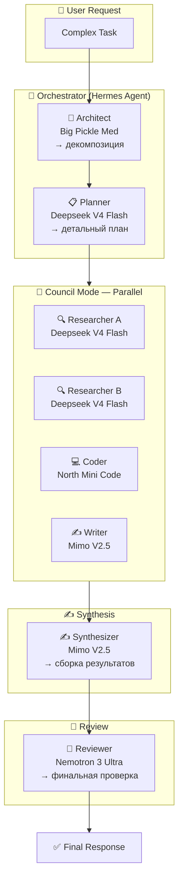
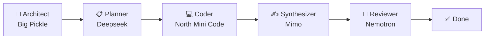
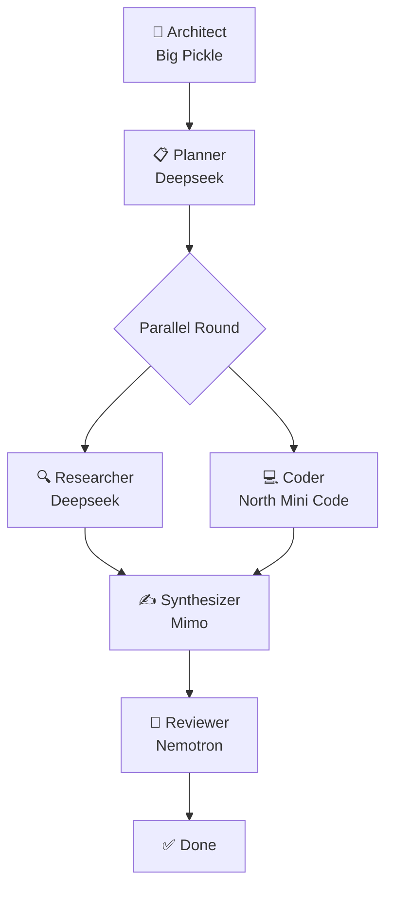

# Hermes Multi-Agent Orchestrator — Architecture

## System Architecture



## Pipeline Mode



## Hybrid Mode



## Model Roster

| Псевдоним | API Model ID | Роль по умолчанию | Сильные стороны | Лимитации |
|-----------|-------------|-------------------|----------------|-----------|
| `big-pickle` | ? | 🎯 Architect | Архитектура, креатив, мета-планирование | Не тестировался на длинных промптах |
| `deepseek` | `deepseek-v4-flash` | 📋 Planner / 🔍 Researcher / 👑 Arbiter | Скорость, balanced, надёжность | Базовая модель |
| `north-mini` | ? | 💻 Coder | Код, технические задачи | Специализирован, вне кода слабее |
| `mimo` | `minimax-m2.5` | ✍️ Synthesizer | Креативность, текст, генерация | Не для кода |
| `nemotron` | `nemotron-3-ultra` | 🔎 Reviewer | Глубокий анализ, рассуждения | **Таймауты на >200 слов**, нестабилен |

## Mode Routing Logic

```
Задача получена
  │
  ├── Research / Comparison / Multi-perspective
  │   └── 🤖 Council — параллельные исследователи → синтез
  │
  ├── Code / Document / Pipeline
  │   └── 🔧 Pipeline — Architect → Planner → Coder → Synthesizer → Reviewer
  │
  └── Complex (research + code + analysis)
      └── 🎭 Hybrid — сначала параллель, потом последовательно
```

## Delegation Flow

```python
# Council mode
tasks = [
    {"goal": "Исследуй аспект A...", "context": "..."},
    {"goal": "Исследуй аспект B...", "context": "..."},
    {"goal": "Исследуй аспект C...", "context": "..."},
]
delegate_task(tasks=tasks)

# Pipeline mode
result1 = delegate_task(goal="Architect: разбей задачу...")
result2 = delegate_task(goal="Coder: реализуй...", context=result1)
result3 = delegate_task(goal="Reviewer: проверь...", context=result2)
```

## Directory Structure

```
hermes-multi-agent-orchestrator/
├── SKILL.md              # Основной скилл (EN инструкции)
├── ARCHITECTURE.md       # Архитектура, схемы, роли  
├── AGENTS.md             # Инструкции для AI-агентов
├── CHANGELOG.md          # История версий
├── README.md             # Документация EN
├── README.ru.md          # Документация RU
├── config/
│   └── models.yaml       # Модели и роли
└── scripts/
    └── plan.sh           # Шаблон объявления плана
```

## Pitfalls

1. **Nemotron timeout** — при длинных контекстах заменять на Deepseek
2. **Sub-agents blind** — параллельные агенты не видят друг друга
3. **Activation first** — объявлять запуск до первой delegate_task
4. **Synthesize output** — никогда не выводить сырые результаты агентов
5. **Channel-aware delivery** — проверять куда отправлять результат
