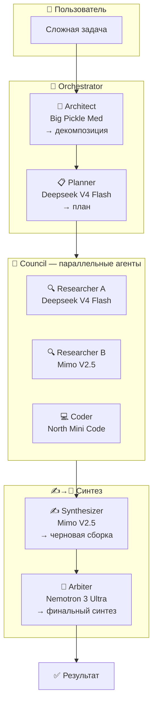
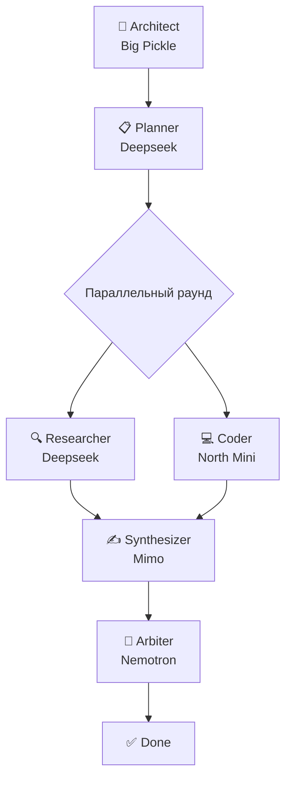

# Hermes Multi-Agent Orchestrator — Architecture

> Архитектура multi-agent оркестратора на 5 моделях OpenCode Zen.
> 3 режима (Council, Pipeline, Hybrid), 5 ролей.
> Подтверждено смок-тестом — см. TEST_RESULTS.md.

## System Architecture



## Pipeline Mode


## Hybrid Mode



## Model Roster

| Псевдоним | Model ID (CLI) | Роль | Сильные стороны |
|-----------|---------------|------|----------------|
| `big-pickle` | `opencode/big-pickle` | 🎯 Architect | Архитектура, креатив, мета-планирование |
| `deepseek` | `opencode/deepseek-v4-flash-free` | 📋 Planner / 🔍 Researcher | Скорость, сбалансированность |
| `mimo` | `opencode/mimo-v2.5-free` | ✍️ Synthesizer | Креативность, генерация |
| `nemotron` | `opencode/nemotron-3-ultra-free` | 👑 Arbiter / 🔎 Reviewer | Глубокий анализ, синтез |
| `north-mini` | `opencode/north-mini-code-free` | 💻 Coder | Код, файловые операции |

## Mode Routing

```
Задача получена
  │
  ├── Research / Comparison / Multi-perspective
  │   └── 🤖 Council — параллельные исследователи → Arbiter
  │
  ├── Code / Document / Pipeline
  │   └── 🔧 Pipeline — Architect → Coder → Synthesizer → Arbiter
  │
  └── Complex (research + code + analysis)
      └── 🎭 Hybrid — сначала параллель, потом последовательно
```

## Поток выполнения

### Шаг 1: Architect (Big Pickle Med)
- Декомпозиция задачи
- Выбор режима (Council/Pipeline/Hybrid)
- Определение количества и ролей агентов

### Шаг 2: Parallel Execution (Council) / Sequential (Pipeline)
- Каждый агент запускается через `opencode run --model <model-id>`
- В Council — все параллельно через `&`
- В Pipeline — последовательно с передачей `context`

### Шаг 3: Synthesis (Mimo V2.5 → Nemotron 3 Ultra)
- Mimo делает черновую сборку результатов
- Nemotron делает финальный глубокий синтез

### Шаг 4: Delivery
- Сохранение `.md` файла
- Отправка пользователю

## Тестирование

Все 5 моделей протестированы. Результаты — в `TEST_RESULTS.md`.

Ключевые выводы:
1. **Big Pickle Med** — отличный архитектор (структура, 10 осей, мета-планирование)
2. **Deepseek V4 Flash** — глубокий фактологический research
3. **Mimo V2.5** — хороший синтезатор, креативная сборка
4. **Nemotron 3 Ultra** — лучший арбитр (глубокий синтез, 7 сценариев выбора)
5. **North Mini Code** — пишет реальный код, создаёт файлы на диске

## Директория проекта

```
hermes-multi-agent-orchestrator/
├── SKILL.md              # Основной скилл
├── ARCHITECTURE.md       # Архитектура и схемы
├── AGENTS.md             # Инструкции для AI-агентов
├── CHANGELOG.md          # История версий
├── TEST_RESULTS.md       # Результаты тестов
├── README.md             # Документация EN
├── README.ru.md          # Документация RU
├── config/
│   └── models.yaml       # Конфиг моделей
└── scripts/
    └── run.sh            # Скрипт запуска
```
